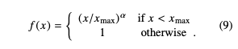
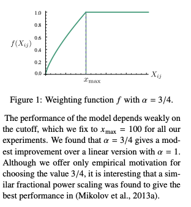

# Implement Glove by TF2.x

* [GloVe: Global Vector for Word Representation](https://nlp.stanford.edu/pubs/glove.pdf)

* Model Details:
  - Notation:  be the matrix of word-word co-occurence counts, where  is the number of times word ``j`` occurs in the context of word ``i``. Let  be the number of times any word appears in the context ``i``. Let  be the probability that word ``j`` appears in the context of word ``i``.
  - The appropriate starting point should be with ratios of co-occurence proabbilities rather than the probabilities themselves. Noting that the ratio of  depends on the three words ``i,j,k``, the most general model tasks:

  .
  
  - Since vector spaces are inherently linear structures, the most nature way todo this with vector differences:

  

  - ``F`` could to be a complicated function but it would obfuscate the linear structure. To avoid this issue, 

  

  - ``F=exp``

  

  - Finally, adding an additional bias:

  

  - The cost function:

  
  
  ``V`` is the size of the vocabulary. The weighting function should obey the following properties:
    -  ``f(0)=0``. It should vanish as ``x->0`` fast enough that ``lim f(x)log^2(x)`` is finite.
    -  ``f(x)`` is non-decreasing 
    -  ``f(x)`` should be relatively small for large values, so that frequent co-occurences are not overweighted.
    -  For example:

    

    

